# Contract Interaction

## Events

1. [Token Contract](https://sepolia.etherscan.io/address/0x6aa41b06c351d56ee34b9c447b3cdb23590e3b22#events)

2. [Ballot Contract](https://sepolia.etherscan.io/address/0xaab60980afd8732915b3b5f0638e6107d93fe638#events)

## Scenario

### Tianbuyung's Interaction

1. Deploy token contract using scripts. The token (GroupEightToken, G8T) contract address is [0x6aa41b06c351d56ee34b9c447b3cdb23590e3b22](https://sepolia.etherscan.io/address/0x6aa41b06c351d56ee34b9c447b3cdb23590e3b22) with the transaction hash: [0xefd64fd0245274a5a485bd91abaacb2c5240382e2138b5aafc786a60e9ac57c7](https://sepolia.etherscan.io/tx/0xefd64fd0245274a5a485bd91abaacb2c5240382e2138b5aafc786a60e9ac57c7).
   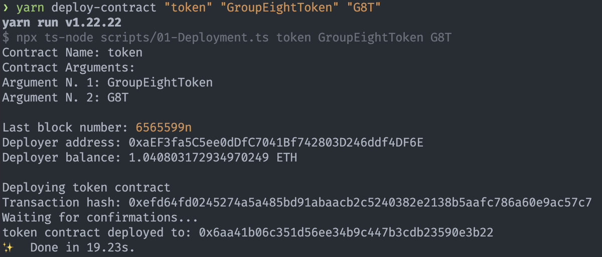

2. Mint 6000 G8T tokens (6000 x 10^18 in wei) on the Sepolia network. The transaction hash: [0xd579b7f8aa9b40345f0a9277b9b64334c854a4dc06f2cecabb5e8f4f31cae8e3](https://sepolia.etherscan.io/tx/0xd579b7f8aa9b40345f0a9277b9b64334c854a4dc06f2cecabb5e8f4f31cae8e3)
   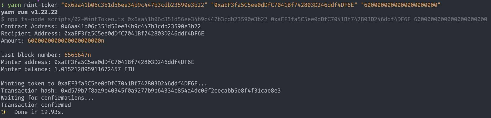

3. Imported the G8T token into my MetaMask account. Then, transferred 1000 G8T tokens to each of my group members using MetaMask. The transaction hashes:

   - 0x3c57af8c645d7b5b6d950e16f1c4d2ef6b321a923258df4b5a17516a2283c5f8
   - 0x6cb072dc5c738fc1ef9b808980279498b41ee7a83b2d14cb311b7dd581819a46
   - 0x73bb1cdeb04776420d003e5609ad5359752be98b359aa3fd4feafe85b0be3a0c
   - 0x0740b2ea3a7fe4f832d1336670de1bf7ed342d3d92b0de83ff84611238312c37
   - 0x7c6ec0a21e8cfff408e46f28681fa03463fbe70d2e916c82de9441b753e1e210

     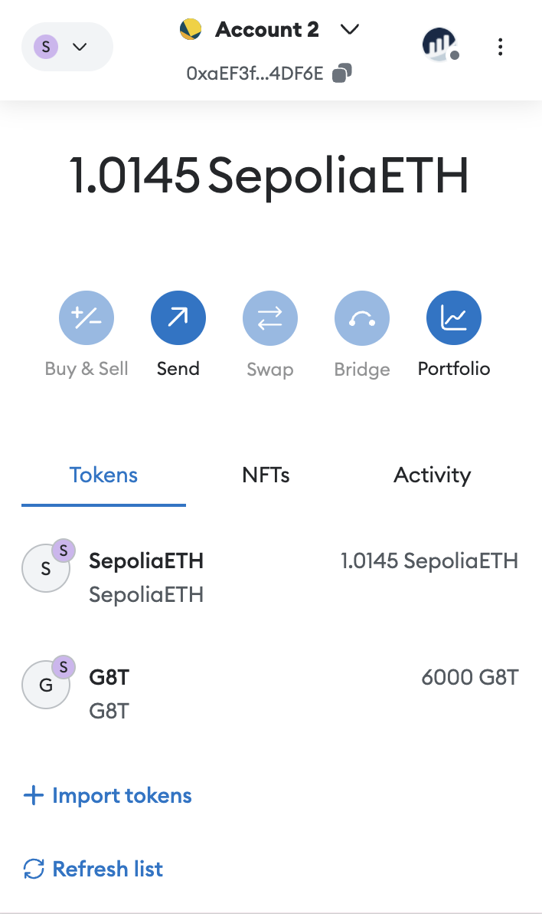
     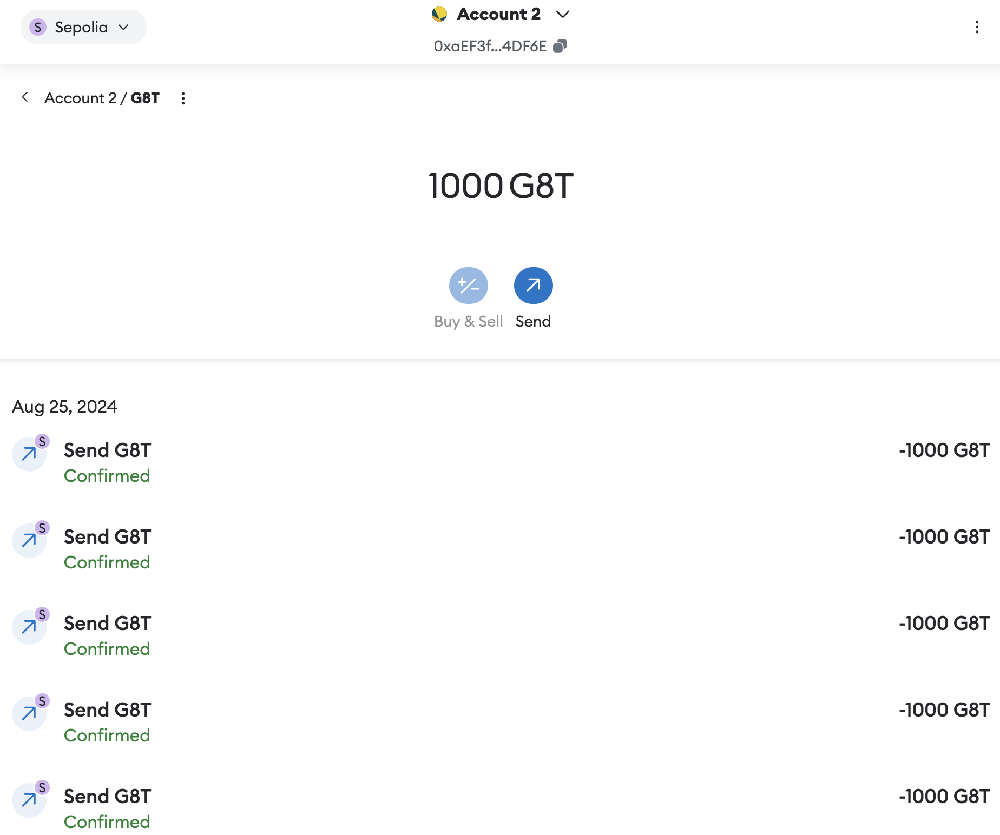

4. Deploy ballot contract using scripts. The ballot with proposals ["Cats", "Dogs", and "Rats"], embed into token address 0x6aa41b06c351d56ee34b9c447b3cdb23590e3b22 and target block number is 6572934 (estimated in 1 day after deploy). I used AI to predict the block number 1 day after deploy.
   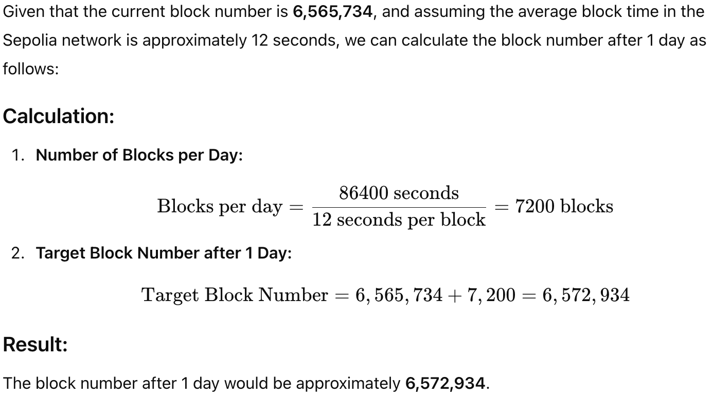

   The Ballot contract address: [0xaab60980afd8732915b3b5f0638e6107d93fe638](https://sepolia.etherscan.io/address/0xaab60980afd8732915b3b5f0638e6107d93fe638) with the transaction hash: [0x75e7af80a9f890d3a765256f3173ab516f6f37fa7968877a59d5552c9da7c8c4](https://sepolia.etherscan.io/tx/0x75e7af80a9f890d3a765256f3173ab516f6f37fa7968877a59d5552c9da7c8c4)
   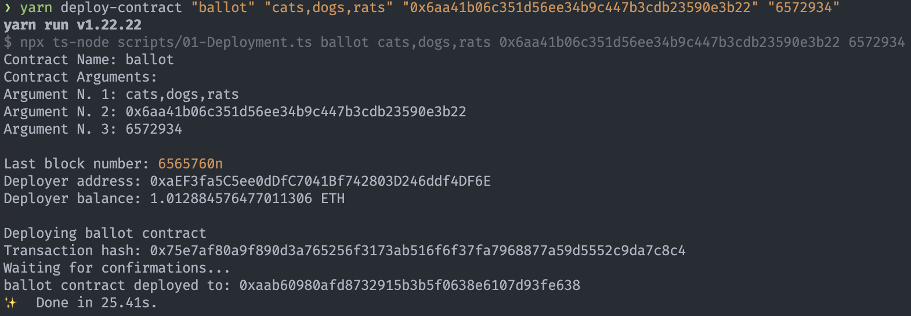

5. Get voting power using script.
   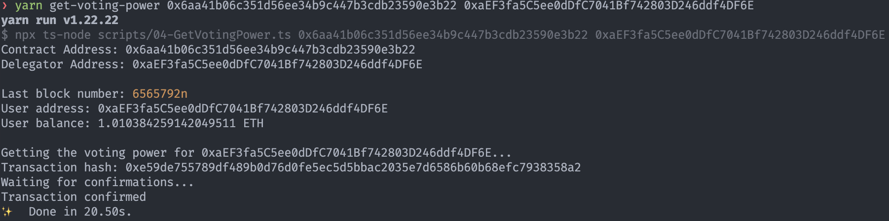

6. Read voting power using script. An error is shown because the target block number has not yet been reached.
   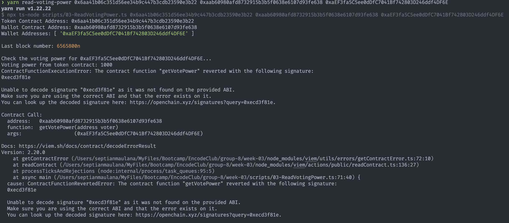

### 0xOwenn / GavinOwen Interaction

7. Import the G8T token into my MetaMask Account that is transferred by "Tianbuyung" 

8. Get voting power using script 

9. Check voting power but throws error because target block number has not yet been reached 

### Joosh75 Interaction

7. Import the G8T token into my MetaMask Account that is transferred by "Tianbuyung" 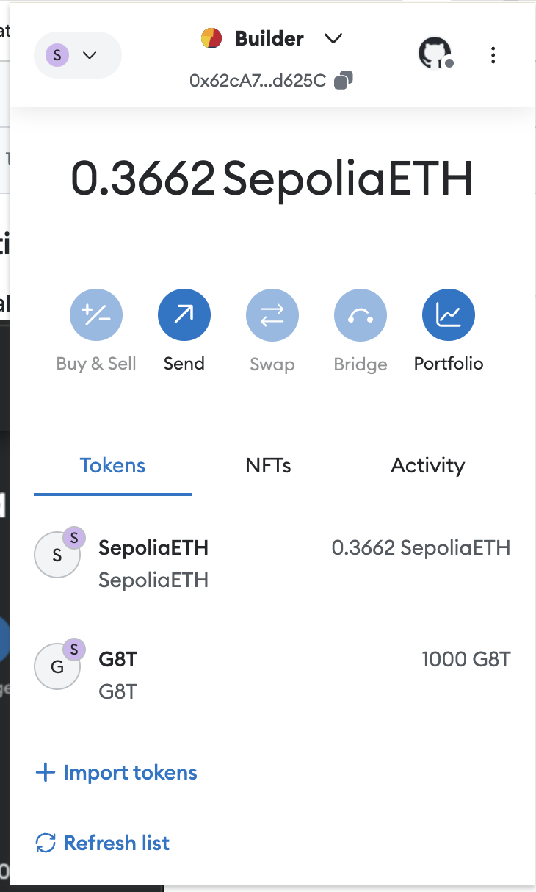

8. Get voting power using script 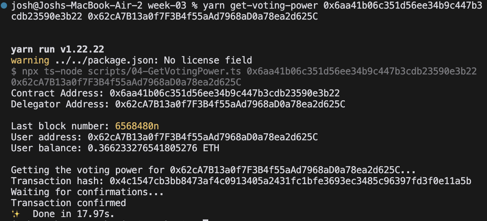

9. Check voting power but throws error because target block number has not yet been reached 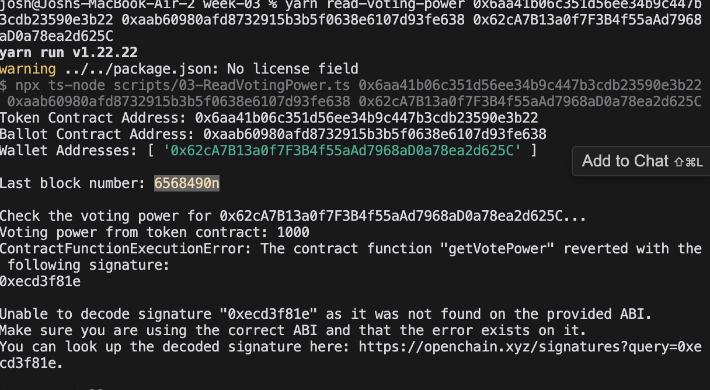

### ErZeTe / Rama Interaction

10. Run the GetVotingPower to get voting power 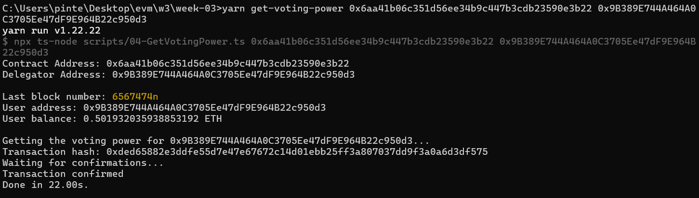

11. Tried to check the voting power I have but failed 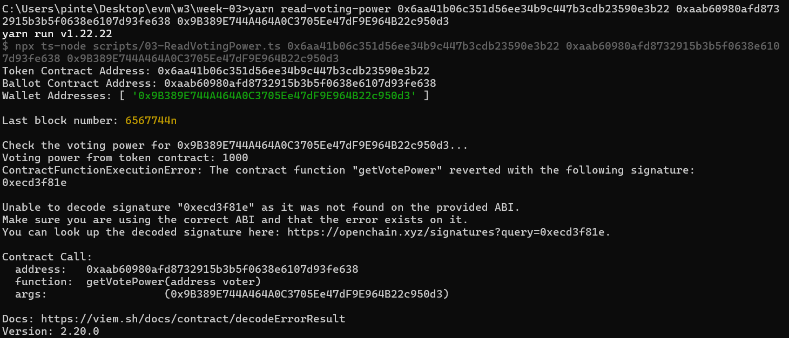

12. Tried to cast vote but failed because it hasn't reached the target block 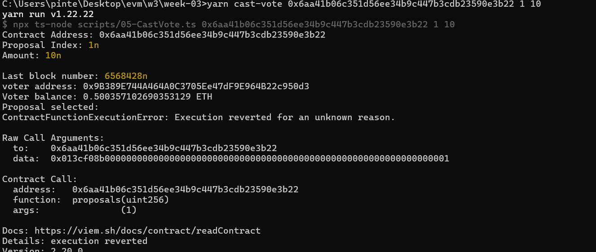

### RajRao10 / Raj Interaction

13. Import the G8T token into my MetaMask Account that is transferred by "Tianbuyung" 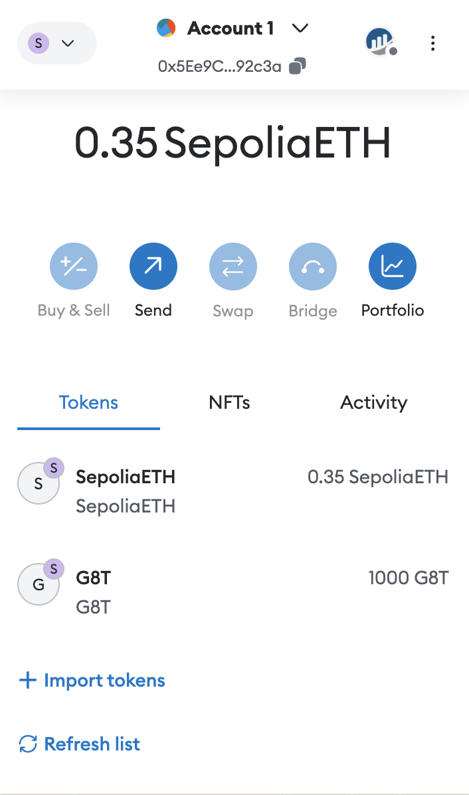

14. Get voting power using script 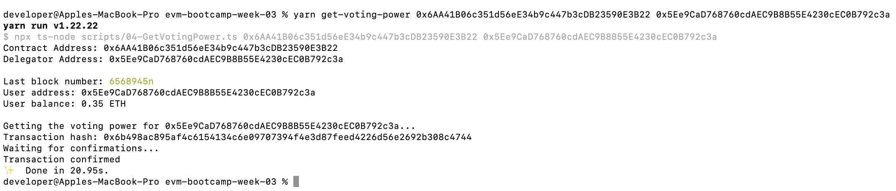

15. Check voting power but throws error because target block number has not yet been reached 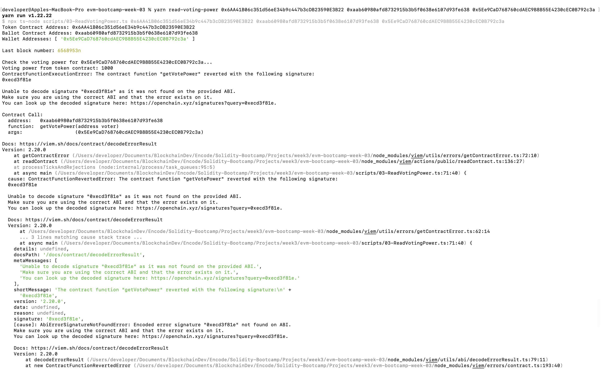

### Vins' Interaction

16. Confirmed GBT token transferred to my wallet from Tianbuyung 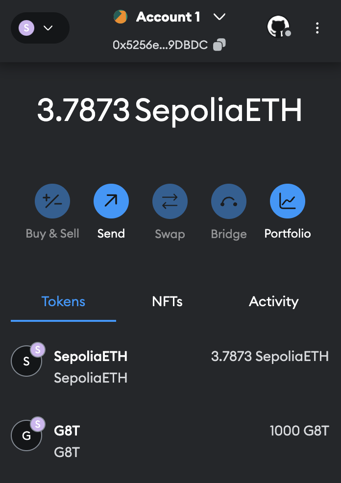

17. Run get voting power and confirm the transaction hash [0x73dccc2ba35299aee1221e0fb1dc45930e5b92219545381a350951ab8a17c924](https://sepolia.etherscan.io/tx/0x73dccc2ba35299aee1221e0fb1dc45930e5b92219545381a350951ab8a17c924) 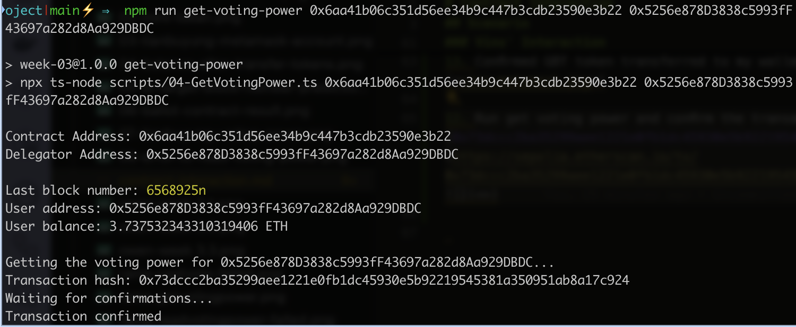

18. Run read voting power but error due to not yet reach the block number 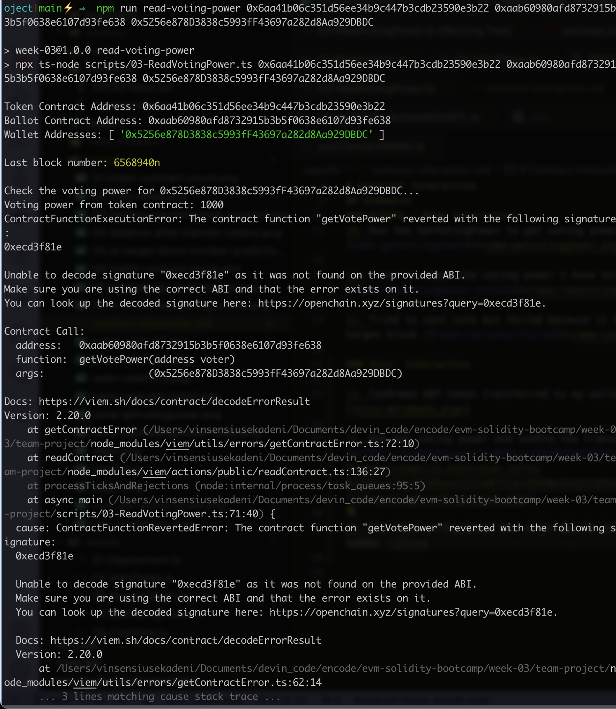
